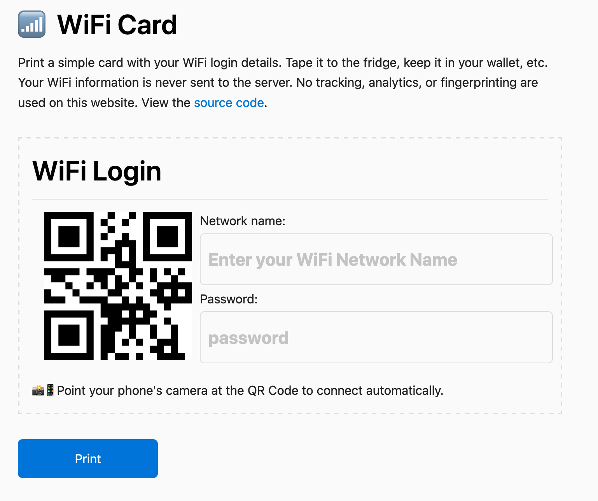

# WiFi Card



Print a neat little card with your WiFi info and stick it on the fridge.

## Development

### Requirements

- [Node.js](https://nodejs.org/en/)
- [Yarn](https://yarnpkg.com/en/) (recommended)

### Steps

Run the live-reload server on <http://localhost:3000>

```bash
make dev
```

## Docker configuration

To dockerize this application I followed the following guide [dockerizing-a-react-app](https://mherman.org/blog/dockerizing-a-react-app/).

To launch the docker container for *development* use:

```bash
make build-dev start-dev-container
```

Then you can access the application at <http://localhost:3001>.

To launch the docker container for *production* use:

```bash
make build-prod start-prod-container
```

Then you can access the application at <http://localhost:1337>.

## 📚 The Tech. Stack

This project uses the following technologies:

**The Front-End**:

- [**React.js**](https://reactjs.org/) - For building the interface along with:
  - [**Styled-Components**](https://www.styled-components.com/) - for styling.
  - [**qrcode.react**](https://github.com/zpao/qrcode.react)

## License

© Nicholas Adamou.

It is free software, and may be redistributed under the terms specified in the [LICENSE] file.

[license]: LICENSE
