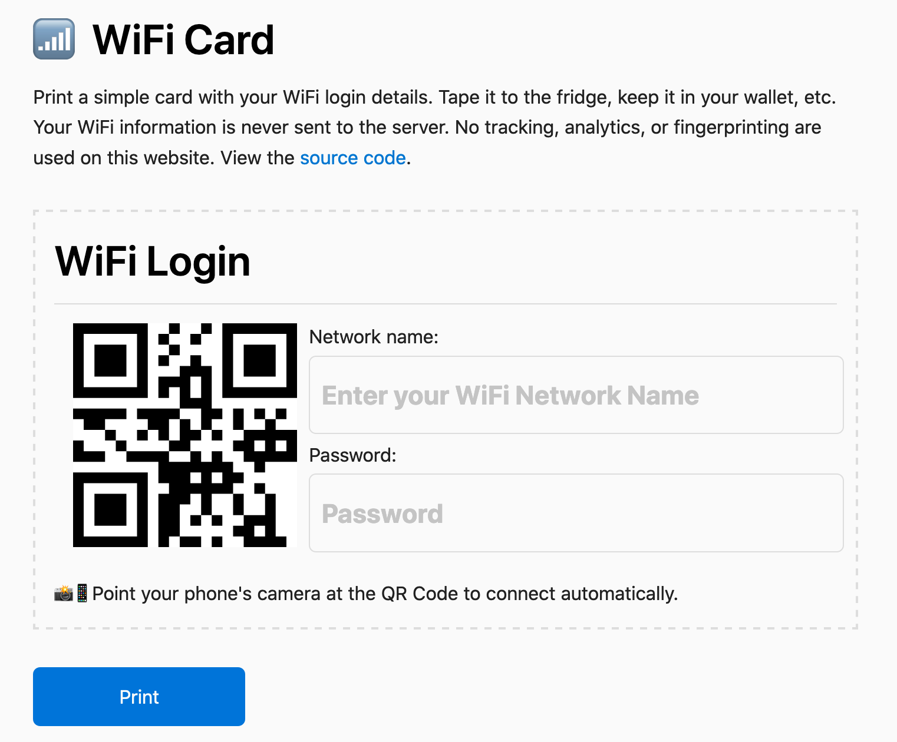

# WiFi Card [](https://circleci.com/gh/nicholasadamou/wifi-card)



Print a neat little card with your WiFi info and stick it on the fridge.

## Development

### Requirements

- [Node.js](https://nodejs.org/en/)
- [Yarn](https://yarnpkg.com/en/) (recommended)

### Steps

Run the live-reload server on <http://localhost:3000>

```bash
make dev
```

## 📚 The Tech. Stack

This project uses the following technologies:

**The Front-End**:

- [**React.js**](https://reactjs.org/) - For building the interface along with:
  - [**Styled-Components**](https://www.styled-components.com/) - for styling.

## ⛓️ CI/CD Pipeline

This project uses the following CI/CD Pipeline:

1. [**CircleCI**](https://circleci.com/) - Used for the same reason as Travis CI.

## License

© Nicholas Adamou.

It is free software, and may be redistributed under the terms specified in the [LICENSE] file.

[license]: LICENSE
